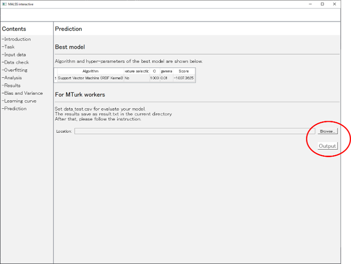

# Instruction for workers with odd-numbered Workers ID

## Requirements

We require:

+ Python (>3.6)

## Settings

1. Create a virtual environment.

    `> python -m venv venv`

1. Activate the virtual environment.

    + Windows

        `(venv)> venv\Scripts\activate`

    + Mac, Linux

        `(venv)$ source/bin/activate`

1. Install libraries

    `pip install git+https://github.com/uec-rk/malss`

1. Download training data and test data

    + [data_train.csv](https://drive.google.com/file/d/1cRYK4U9zjOZZnbzsOEgkBR4HOSgDgQ9h/view?usp=sharing)

    + [data_test.csv](https://drive.google.com/file/d/14Q3vAHk8MwY-uy0ZdwVgHGc38JYWxdzM/view?usp=sharing)

## Data analysis experiment  

You will be asked to perform a simple data analysis task.
The steps of the analysis are as follows:

1. Start up a command line (Windows) or terminal (Mac, Linux), and activate the virtual environment.

1. Run the Python interpreter

    `(venv)> python`

1. Analyze data using a library

    ```
    from malss import MALSS
    MALSS(interactive=True)
    ```

    A GUI is launched. Please follow the instruction of the application.  
    The task is a **<font color="orange">regression task</font>**.  
    You will make a model that predict _Target_ variable in **<font color="orange">data_train.csv</font>**.  
    Variables to predict _Target_ variable are _Cat1_, _Cat2_, _Num1_, ..., _Num19_.  
    Note that **<font color="orange">_Cat1_ and _Cat2_ are categorical variables</font>**.

1. Evaluate the performance of the model

    Evaluate the performance of the model using **<font color="orange">data_test.csv</font>**.  
    The results are saved as _result.txt_ in the current directory.  
    **Copy the text in the result.txt and paste to the form in the machine learning survey.**

    